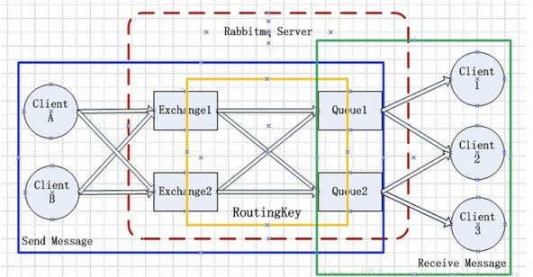
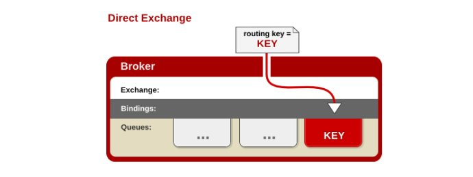
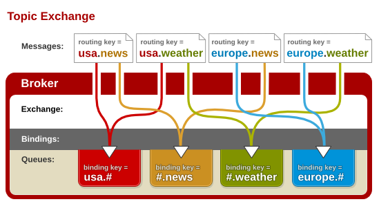
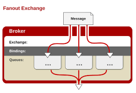

# RabbitMQ

Chiang Yin-tso

[TOC]

## AMQP协议

### Exchange 交换机

#### 作用

接收消息，并根据路由键转发消息所绑定的队列

#### 属性

- name：交换机名称

- type：交换机类型

  - direct

    - 所有发送到Direct Exchange的消息被转发到routing key中指定的Queue

    - direct模式可以使用rabbitmq自带的exchange：default exchange

    - routing key必须完全匹配才会被队列接收，否则该消息会被抛弃
  
    
  - [topic](https://www.rabbitmq.com/tutorials/tutorial-five-python.html)

    - 可以使用通配符模糊匹配

      - \* (star) can substitute for exactly one word.
      - \# (hash) can substitute for zero or more words.
      
      

  - fanout

    - 不处理routingKey，只要将队列绑定到交换机上即可

    - 性能最高

      

  - headers

- durability：是否需要持久化
- auto delete：当最后一个绑定到Exchange的队列删除后，自动删除该Exchange
- internal：当前Exchange是否用于RabbitMQ内部使用
- Arguments：扩展参数，用于扩展AMQP协议自定制化使用

#### 默认交换机

 The default exchange is implicitly bound to every queue, with a routing key equal to the queue name. It is not possible to explicitly bind to, or unbind from the default exchange. It also cannot be deleted. 

### Binding 绑定

Exchange和Exchange、Queue之间的关系。Binding中可以包含RoutingKey或者参数。

### Queue 消息队列

消息队列，实际存储消息数据。

#### 属性

- Durability：是否持久化。Durable：是，Transient：否
- Auto delete：最后一个监听被移除后，是否自动删除该队列

### Message 消息

服务器和引用程序之间传送的数据，由Properties和Payload(Body)组成

- delivery mode：消息持久化，2持久化，1不持久化
- content encoding：编码方式
- expiration：过期时间
- headers：自定义属性

### Virtual Host 虚拟主机

虚拟地址，用于逻辑隔离，最上层的消息路由。一个virtual host中可以有若干个Exchange和Queue，同一个virtual host中不能有相同名称的Exchange或Queue。